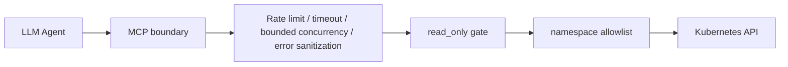

<div align="center">

# k8s-mcp

**A controllable Kubernetes MCP server for LLM agents**

[中文](./README.md) · [Quick start](./docs/quickstart.en.md) · [Security](./docs/security.en.md) · [GPU operations](./docs/gpu.en.md) · [Documentation](./docs/README.en.md) · [Contributing](./CONTRIBUTING.md)

[](https://github.com/bilbilmyc/k8s-mcp/actions/workflows/ci.yml)
[](https://www.python.org/)
[](./LICENSE)
[](https://modelcontextprotocol.io/)

</div>

`k8s-mcp` exposes Kubernetes operations to Claude, Cursor, Cline, Cherry Studio, and other MCP clients. It currently provides **87 tools** for resource inspection, logs and events, workload delivery, RBAC/NetworkPolicy analysis, Prometheus, notifications, cluster diagnostics, and NVIDIA GPU operations.

> [!IMPORTANT]
> **Read, write, and delete are enabled by default.** Set `K8S_MCP_READ_ONLY=true` explicitly for audit, rehearsal, or diagnostic sessions. Production writes should still use `K8S_MCP_NAMESPACE_ALLOWLIST` and least-privilege RBAC.

## Why k8s-mcp

- **Controllable safety:** an on-demand read-only mode, namespace write boundaries, per-tool rate limiting, call timeouts, a bounded worker pool, and sanitized Kubernetes errors.
- **Designed for agents:** constrained tool inputs and diagnostic/explanation tools reduce trial-and-error calls.
- **Operable:** a `doctor` command, reproducible bootstrap manifests, and CI checks for tool, documentation, and version drift.
- **Incremental authorization:** begin with a read-only `view` identity and grant narrow namespace Roles only when writes are required.

## Five-minute quick start

### 1. Install and inspect

```bash
pip install k8s-mcp-bilbilmyc
k8s-mcp --help
k8s-mcp doctor
```

`doctor` neither connects to the cluster nor prints credentials. It only reports redacted runtime policy; `read_only` is `false` by default.

### 2. Provide Kubernetes credentials

```bash
export KUBECONFIG="$HOME/.kube/config"   # optional when using the default path
export K8S_MCP_READ_ONLY=false             # default; optional to set
```

See [Quick start](./docs/quickstart.en.md) for kubeconfig, API-server token, and in-cluster authentication.

### 3. Configure an MCP client

```json
{
  "mcpServers": {
    "k8s": {
      "command": "k8s-mcp",
      "args": ["serve"],
      "env": {
        "K8S_MCP_READ_ONLY": "false",
        "KUBECONFIG": "/absolute/path/to/kubeconfig"
      }
    }
  }
}
```

The historical no-argument launch remains compatible: `k8s-mcp` starts the stdio server by default. See [Quick start](./docs/quickstart.en.md) for client configuration, Windows paths, and troubleshooting.

### 4. Switch to read-only mode when needed

```bash
export K8S_MCP_READ_ONLY=true
k8s-mcp doctor
```

For ordinary write access, still scope it with `K8S_MCP_NAMESPACE_ALLOWLIST=staging,preview` and avoid an unrestricted namespace policy with a cluster-admin kubeconfig. Use the [deployment and RBAC templates](./docs/deployment.en.md).

## Capability overview

| Use case | Representative tools |
| --- | --- |
| Observe and diagnose | `cluster_health_snapshot`, `get_pod_logs`, `list_events`, `diagnose_pod`, `explain_pod` |
| Deliver workloads | `create_deployment`, `scale_workload`, `set_image`, `rollout_status`, `wait_for_resource` |
| Generic resources | `list_resources`, `get_resource`, `apply_yaml`, `diff_resource`, `delete_resource` |
| Security and networking | `whoami`, `analyze_rbac`, `analyze_networkpolicy`, `audit_secrets` |
| Observability | `top_pods`, `top_nodes`, `prometheus_query`, `find_prometheus_service` |
| NVIDIA GPU / AI operations | `gpu_cluster_overview`, `gpu_diagnose`, `gpu_node_inspect`, `gpu_workload_inspect`, `gpu_pending_workloads` |
| Notifications and bootstrap | `notify`, `bootstrap_metrics_server`, `bootstrap_local_path_provisioner` |

See the [tool catalog](./docs/tools-reference.md) for complete signatures and grouping.

## Safety model



- **Read-only is opt-in:** when `K8S_MCP_READ_ONLY=true`, every write, patch, apply, and delete operation is rejected at the `read_only` gate.
- **A timeout does not kill a thread:** synchronous Kubernetes SDK calls cannot be safely killed. A timed-out call retains its worker slot until it returns, preventing runaway agents from accumulating background work.
- **Webhook protection:** HTTPS is required by default, literal private/loopback hosts are refused, and redirects are disabled. Internal hooks require an explicit opt-in.
- **Reproducible bootstrap:** defaults use version-pinned manifests instead of moving `master` or `latest` URLs.

Read the full [security model](./docs/security.en.md) for the threat model, environment variables, and migration guidance.

## Documentation

| Goal | 中文 | English |
| --- | --- | --- |
| Installation, auth, and clients | [快速开始](./docs/quickstart.md) | [Quick start](./docs/quickstart.en.md) |
| Permissions and runtime policy | [安全模型](./docs/security.md) | [Security](./docs/security.en.md) |
| Kubernetes RBAC deployment | [部署指南](./docs/deployment.md) | [Deployment](./docs/deployment.en.md) |
| NVIDIA GPU / AI workloads | [GPU 运维](./docs/gpu.md) | [GPU operations](./docs/gpu.en.md) |
| All environment variables | [环境变量](./docs/env.md) | [Environment](./docs/env.en.md) |
| Maintainer docs index | [文档首页](./docs/README.md) | [Documentation](./docs/README.en.md) |
| Full tool catalog | [工具参考](./docs/tools-reference.md) | [Tool catalog](./docs/tools-reference.md) |

## Development and release

```bash
uv sync --all-extras --dev
uv run ruff check .
uv run pytest -q
uv run python scripts/pre_release_check.py
```

CI checks tests, lint, the tool inventory, core bilingual documentation counts, and version alignment. See [CONTRIBUTING.md](./CONTRIBUTING.md) and [the publishing guide](./docs/publishing.md).

## License

Released under the [MIT License](./LICENSE).
