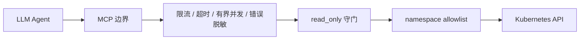

<div align="center">

# k8s-mcp

**面向 LLM Agent 的、可控 Kubernetes MCP Server**

[English](./README.en.md) · [快速开始](./docs/quickstart.md) · [安全模型](./docs/security.md) · [GPU 运维](./docs/gpu.md) · [完整文档](./docs/README.md) · [贡献](./CONTRIBUTING.md)

[](https://github.com/bilbilmyc/k8s-mcp/actions/workflows/ci.yml)
[](https://www.python.org/)
[](./LICENSE)
[](https://modelcontextprotocol.io/)

</div>

`k8s-mcp` 将 Kubernetes 运维能力以 MCP 工具暴露给 Claude、Cursor、Cline、Cherry Studio 等 Agent。当前提供 **91 个**工具，覆盖资源检索、日志与事件、工作负载交付、RBAC/NetworkPolicy 分析、Prometheus、告警通知、集群诊断与 NVIDIA GPU 运维。

> [!IMPORTANT]
> **默认允许读写与删除。** 需要审计、演练或诊断时，显式设置 `K8S_MCP_READ_ONLY=true` 进入只读模式。生产写入仍建议配置 `K8S_MCP_NAMESPACE_ALLOWLIST` 与最小 RBAC。

## 为什么选择它

- **安全可控**：可随时切换只读模式、namespace 写入边界、每工具限流、调用超时、有界 worker pool、Kubernetes 错误脱敏。
- **Agent 友好**：工具说明提供参数约束与下一步建议；诊断、解释和分析工具减少“先 list 再猜”的多轮调用。
- **可运营**：`doctor` 命令、可复现的组件 manifest、CI 中的工具数/文档/版本一致性检查。
- **可渐进授权**：从只读 `view` 身份开始；仅为需要写入的 namespace 配置窄权限 Role。

## 5 分钟快速开始

### 1. 安装并自检

```bash
pip install k8s-mcp-bilbilmyc
k8s-mcp --help
k8s-mcp doctor
```

`doctor` 不会连接集群，也不会输出 token；它只显示脱敏后的运行策略。默认输出中 `read_only` 为 `false`。

### 2. 准备 Kubernetes 凭据

```bash
export KUBECONFIG="$HOME/.kube/config"   # 已使用默认路径时可省略
export K8S_MCP_READ_ONLY=false             # 默认值；可省略
```

详细认证路径（kubeconfig、API Server token、in-cluster）见[快速开始](./docs/quickstart.md)。

### 3. 配置 MCP 客户端

```json
{
  "mcpServers": {
    "k8s": {
      "command": "k8s-mcp",
      "args": ["serve"],
      "env": {
        "K8S_MCP_READ_ONLY": "false",
        "KUBECONFIG": "/absolute/path/to/kubeconfig"
      }
    }
  }
}
```

不带 `serve` 参数也保持兼容：`k8s-mcp` 默认以 stdio 启动。客户端配置、Windows 路径和排障请看[快速开始](./docs/quickstart.md)。

### 4. 必要时切换为只读模式

```bash
export K8S_MCP_READ_ONLY=true
k8s-mcp doctor
```

常规写入场景建议仍设置 `K8S_MCP_NAMESPACE_ALLOWLIST=staging,preview`，并避免使用“无限 namespace + 集群管理员 kubeconfig”。请采用[部署与 RBAC 模板](./docs/deployment.md)。

## 工具能力一览

| 场景 | 代表工具 |
| --- | --- |
| 观察与排障 | `cluster_health_snapshot`、`get_pod_logs`、`list_events`、`diagnose_pod`、`explain_pod` |
| 工作负载交付 | `create_deployment`、`scale_workload`、`set_image`、`rollout_status`、`wait_for_resource` |
| 通用资源操作 | `list_resources`、`get_resource`、`apply_yaml`、`diff_resource`、`delete_resource` |
| 安全与网络 | `whoami`、`analyze_rbac`、`analyze_networkpolicy`、`audit_secrets` |
| 可观测性 | `top_pods`、`top_nodes`、`prometheus_query`、`find_prometheus_service` |
| NVIDIA GPU / AI 运维 | `gpu_cluster_overview`、`gpu_diagnose`、`gpu_node_inspect`、`gpu_workload_inspect`、`gpu_pending_workloads`、`gpu_metrics_catalog`、`gpu_utilization_overview`、`gpu_workload_utilization`、`gpu_utilization_history` |
| 通知与基础能力 | `notify`、`bootstrap_metrics_server`、`bootstrap_local_path_provisioner` |

完整签名和按功能分类的目录见[工具参考](./docs/tools-reference.md)。

## 安全设计



- **只读按需开启**：设置 `K8S_MCP_READ_ONLY=true` 后，所有写、patch、apply、delete 类操作都会被 `read_only` 守门拒绝。
- **超时不等于中止线程**：同步 Kubernetes SDK 请求无法安全强杀；超时后 worker slot 仍占用，直到请求自然结束，避免失控 Agent 堆积后台任务。
- **Webhook 防护**：默认仅 HTTPS，拒绝字面量私网/回环地址，且禁用自动重定向；企业内网 webhook 需要显式 opt-in。
- **引导组件可复现**：默认 manifest 固定到版本，而不是移动的 `master` 或 `latest` URL。

完整威胁模型、环境变量和升级指引见[安全模型](./docs/security.md)。

## 文档导航

| 目标 | 中文 | English |
| --- | --- | --- |
| 安装、认证、客户端配置 | [快速开始](./docs/quickstart.md) | [Quick start](./docs/quickstart.en.md) |
| 权限、安全、运行策略 | [安全模型](./docs/security.md) | [Security](./docs/security.en.md) |
| Kubernetes RBAC 部署 | [部署指南](./docs/deployment.md) | [Deployment](./docs/deployment.en.md) |
| NVIDIA GPU / AI 工作负载 | [GPU 运维](./docs/gpu.md) | [GPU operations](./docs/gpu.en.md) |
| 全部环境变量 | [环境变量](./docs/env.md) | [Environment](./docs/env.en.md) |
| 维护者文档索引 | [文档首页](./docs/README.md) | [Documentation](./docs/README.en.md) |
| 完整工具目录 | [工具参考](./docs/tools-reference.md) | [Tool catalog](./docs/tools-reference.md) |

## 开发与发布

```bash
uv sync --all-extras --dev
uv run ruff check .
uv run pytest -q
uv run python scripts/pre_release_check.py
```

每次 CI 会校验测试、lint、工具数、核心中英文文档中的工具数与版本一致性。贡献流程见[CONTRIBUTING.md](./CONTRIBUTING.md)，发版流程见[docs/publishing.md](./docs/publishing.md)。

## 许可证

以 [MIT License](./LICENSE) 发布。
