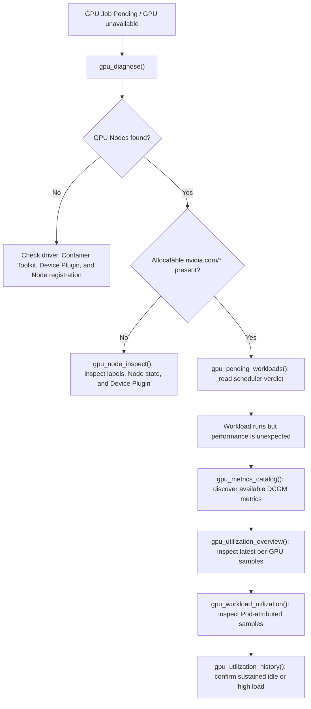

# NVIDIA GPU / AI workload operations

[中文](./gpu.md) · [Documentation](./README.en.md) · [RBAC template](../deploy/rbac/nvidia-gpu-read-only.yaml) · [Prometheus configuration](./env.en.md)

`k8s-mcp` now provides nine **read-only** NVIDIA GPU tools for Kubernetes resource/scheduling diagnostics and live Prometheus/DCGM metric discovery. Resource tools discover the `nvidia.com/*` extended resources that are actually exposed instead of assuming a GPU SKU, MIG profile, or GPU Operator version. Metric tools first discover the DCGM metrics that exist in the target Prometheus, then allow custom metric names when required.

> [!IMPORTANT]
> Every `gpu_*` tool is always read-only. None installs, upgrades, or changes NVIDIA GPU Operator, Node labels, taints, MIG configuration, time-slicing, or workloads. `K8S_MCP_READ_ONLY=false` does **not** implicitly enable high-impact GPU administration.

## Prerequisites

### Resource and scheduling diagnostics

1. Kubernetes Nodes must expose NVIDIA extended resources through a Device Plugin. The common resource is `nvidia.com/gpu`; MIG environments can also expose `nvidia.com/mig-*`.
2. NVIDIA GPU Operator commonly runs in the `gpu-operator` namespace. For another namespace, pass `gpu_diagnose(operator_namespace="<namespace>")`.

### Utilization and framebuffer metrics

Metric tools reuse the existing Prometheus connection configuration; they add neither Kubernetes write permission nor a new credential:

```bash
K8S_MCP_PROMETHEUS_URL=https://prometheus.example:9090
# Optional when the endpoint requires authentication
K8S_MCP_PROMETHEUS_BEARER_TOKEN=<token>
```

If no URL is configured, call `find_prometheus_service()` first, or pass `prometheus_url` to an individual GPU metric tool. Prometheus must scrape DCGM Exporter (or a compatible exporter). Metric names and labels vary by installation, so start with `gpu_metrics_catalog()` rather than assuming the default names are present.

## Least-privilege RBAC

Apply [`nvidia-gpu-read-only.yaml`](../deploy/rbac/nvidia-gpu-read-only.yaml) for the minimum read permissions required by resource and scheduling diagnostics:

```bash
kubectl apply -f deploy/rbac/nvidia-gpu-read-only.yaml
```

The template grants only `get/list` on Nodes, Pods, Deployments, Jobs, and the optional `clusterpolicies.nvidia.com` resource—no writes, deletes, Pod exec, or Secret access. Metric tools call the Prometheus HTTP API and therefore use its existing access controls; they do not require broader Kubernetes RBAC.

## Tools and recommended workflow

### 1. Resources and scheduling: establish whether the workload can run

```text
gpu_cluster_overview()
gpu_node_inspect(name="gpu-worker-01")
gpu_workload_inspect(name="trainer-0", namespace="ml", kind="Pod")
gpu_pending_workloads(namespace="ml", limit=100)
gpu_diagnose(operator_namespace="gpu-operator")
```

- `gpu_cluster_overview`: GPU Node count, `nvidia.com/*` capacity/allocatable resources, active GPU Pod limits, and optional ClusterPolicy.
- `gpu_node_inspect`: one Node's Ready/schedulable state, taints, NVIDIA labels, GPU/MIG resources, and placed GPU Pods.
- `gpu_workload_inspect`: live Pod limits, placement, and scheduler verdict; or Deployment/Job template limits and matching Pods.
- `gpu_pending_workloads`: only Pending Pods with `nvidia.com/*` limits, including the scheduler reason.
- `gpu_diagnose`: combined check of GPU Nodes, ClusterPolicy, GPU Operator component Pods, and Pending GPU workloads.

GPU extended resources should be declared in container `limits`. These tools display the limits Kubernetes actually returns; they do not guess CUDA, image, or driver versions.

### 2. Metric discovery: establish what can be queried

```text
gpu_metrics_catalog()
gpu_metrics_catalog(metric_prefix="DCGM_", limit=200)
```

`gpu_metrics_catalog` runs a read-only PromQL metadata query and lists real metric names matching the prefix, with their series counts. By default it discovers the `DCGM_` prefix. Use it to verify whether common names such as `DCGM_FI_DEV_GPU_UTIL` and `DCGM_FI_DEV_FB_USED` really exist, or to find the naming used by a custom exporter.

### 3. Node/GPU utilization: read latest samples

```text
gpu_utilization_overview()
gpu_utilization_overview(
  utilization_metric="DCGM_FI_DEV_GPU_UTIL",
  memory_used_metric="DCGM_FI_DEV_FB_USED",
  memory_total_metric="DCGM_FI_DEV_FB_TOTAL",
)
```

The tool reads the latest raw samples from three instant vectors and joins them per GPU using common `Hostname`, `gpu`, and `UUID` labels (plus compatible variants). It reports utilization, framebuffer used/total, and a used ratio when it can be calculated. **Value units follow the exporter metric you selected**; the tool does not silently convert units whose semantics were not verified.

If one metric is absent, the remaining available metrics stay visible. The report identifies missing metrics and points back to `gpu_metrics_catalog()` to select names that actually exist.

### 4. Pod-level utilization: query after verifying attribution labels

```text
gpu_workload_utilization(pod_name="trainer-0", namespace="ml")
gpu_workload_utilization(
  pod_name="trainer-0",
  namespace="ml",
  metric_name="DCGM_FI_DEV_GPU_UTIL",
)
```

This tool reads the latest samples for one Pod using exact Prometheus `namespace` and `pod` labels, and displays GPU identity, container, and value. The selected exporter metric must carry Kubernetes Pod labels. If no series match, use `gpu_utilization_overview()` for Node/GPU-level data or check the DCGM Exporter Kubernetes label mapping.

### 5. Historical utilization: use a bounded time window

```text
gpu_utilization_history()
gpu_utilization_history(duration="6h", step="5m")
gpu_utilization_history(
  duration="1h",
  step="1m",
  namespace="ml",
  pod_name="trainer-0",
)
```

`gpu_utilization_history` uses a Prometheus range query to summarize sample count, minimum, average, maximum, and latest value for each GPU series instead of dumping every point. The window is capped at 7 days, the minimum step is 15 seconds, each series is limited to at most 1000 theoretical points, and at most 100 series can be rendered. Units still follow the selected exporter metric.

## Common diagnostic path



## Scope and next steps

This release provides live **instant** metrics and bounded history summaries of up to 7 days, but not capacity forecasting, alert-rule changes, GPU Operator installation/upgrades, MIG/time-slicing changes, or DRA ResourceClaim writes.

| Phase | Status | Planned capability | Safety boundary |
|---|---|---|---|
| GPU diagnostics foundation | ✅ Complete | Node, workload, Pending scheduling, and GPU Operator state diagnostics | Read-only Kubernetes API access |
| Prometheus / DCGM instant observability | ✅ Complete | Metric discovery, latest per-GPU utilization, and Pod-attributed samples | Read-only PromQL instant queries |
| Time series and capacity analysis | 🚧 Partially complete | `gpu_utilization_history` is available; `gpu_capacity_analyze` and `gpu_idle_resources` are next | Bounded PromQL range queries correlated with read-only Kubernetes resources |
| MIG and DRA discovery | 🧭 Planned | MIG strategy/profile/resource summaries; ResourceClaim, DeviceClass, and ResourceSlice availability and binding state | Discovery and recommendations only; no CRD or Node configuration mutations |
| GPU management actions | 🔒 Not enabled by default | GPU Operator lifecycle, MIG/time-slicing reconfiguration, and DRA writes | If ever added, require a dedicated switch independent of `K8S_MCP_READ_ONLY`, allowlists, a dry-run plan, and explicit confirmation |

The next phase correlates utilization history with Kubernetes allocatable resources and Pod limits to determine whether requested capacity matches observed utilization and whether capacity is fragmented. High-impact GPU management will never be enabled merely by `K8S_MCP_READ_ONLY=false`.
