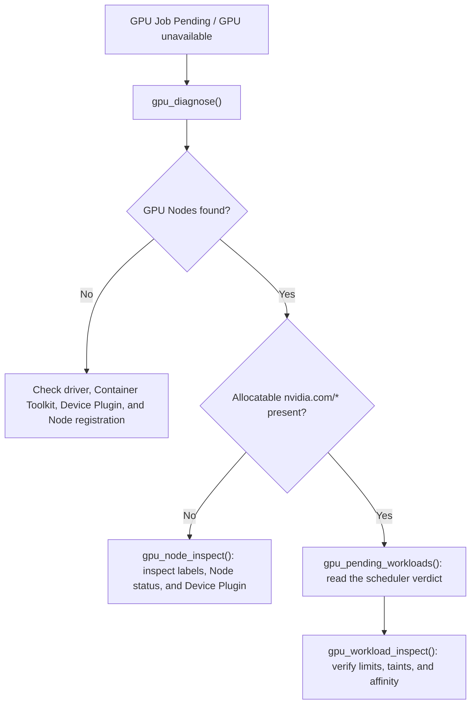

# NVIDIA GPU / AI workload operations

[中文](./gpu.md) · [Documentation](./README.en.md) · [RBAC template](../deploy/rbac/nvidia-gpu-read-only.yaml)

`k8s-mcp` now provides five **read-only** NVIDIA GPU diagnostic tools. They discover the Kubernetes `nvidia.com/*` extended resources that are actually present instead of assuming a GPU SKU, MIG profile, or GPU Operator version. That covers conventional `nvidia.com/gpu`, MIG resources, and NVIDIA Device Plugin installations managed outside GPU Operator.

> [!IMPORTANT]
> These tools never install, upgrade, or modify NVIDIA GPU Operator; they do not change node labels, taints, MIG configuration, or workloads. They stay read-only even when the server normally runs with write access.

## Prerequisites

1. Kubernetes Nodes must expose NVIDIA extended resources through a Device Plugin. The common resource is `nvidia.com/gpu`; MIG environments can also expose `nvidia.com/mig-*`.
2. NVIDIA GPU Operator commonly runs in the `gpu-operator` namespace. Pass `gpu_diagnose(operator_namespace="<namespace>")` for another namespace.
3. For live utilization, memory, or power telemetry, continue to use the existing Prometheus / DCGM Exporter integration. This release diagnoses resources and scheduling only; it intentionally does not assume a particular DCGM metric name.

## Least-privilege RBAC

Apply [`nvidia-gpu-read-only.yaml`](../deploy/rbac/nvidia-gpu-read-only.yaml) for the minimum read privileges needed by the GPU tools:

```bash
kubectl apply -f deploy/rbac/nvidia-gpu-read-only.yaml
```

The template grants only `get/list` access to Nodes, Pods, Deployments, Jobs, and the optional `clusterpolicies.nvidia.com` resource. It grants no writes, deletes, Pod exec, or Secret access. Replace the example ServiceAccount namespace before applying it.

## Tools and recommended workflow

### 1. Cluster overview

```text
gpu_cluster_overview()
```

Reports GPU Node count, each Node's capacity and allocatable `nvidia.com/*` resources, active GPU Pod limits, and an optional GPU Operator ClusterPolicy summary.

Use it first to answer: **Does the cluster see GPUs, what can it allocate, and how many GPU workloads are active?**

### 2. Inspect one Node

```text
gpu_node_inspect(name="gpu-worker-01")
```

Shows Ready and schedulable state, taints, NVIDIA labels, dynamically discovered GPU/MIG resources, and GPU Pods placed on the Node.

Use it when a Node has a driver but no `nvidia.com/gpu`, or when workloads will not schedule onto that Node.

### 3. Inspect a workload

```text
gpu_workload_inspect(name="training-job", namespace="ml", kind="Job")
gpu_workload_inspect(name="inference-api", namespace="ml", kind="Deployment")
gpu_workload_inspect(name="trainer-0", namespace="ml", kind="Pod")
```

- `Pod`: live GPU limits, Node placement, Pod phase, and the scheduler's `PodScheduled=False` reason.
- `Deployment` / `Job`: GPU limits declared by the Pod template plus GPU Pods matched by the workload selector.

GPU resources should be declared in a container's `limits`. `gpu_workload_inspect` displays the limits Kubernetes actually returns; it never guesses CUDA or image versions.

### 4. Find GPU workloads waiting to schedule

```text
gpu_pending_workloads()
gpu_pending_workloads(namespace="ml", limit=100)
```

Returns only Pending Pods with `nvidia.com/*` limits and retains the scheduler's reason text, distinguishing capacity exhaustion, taints/tolerations, affinity, and MIG-profile mismatches.

### 5. One-shot health diagnosis

```text
gpu_diagnose()
gpu_diagnose(operator_namespace="nvidia")
```

The findings cover:

1. discovered GPU Nodes, Ready state, and allocatable NVIDIA resources;
2. optional GPU Operator `ClusterPolicy` presence and state;
3. readiness of Device Plugin, DCGM Exporter, MIG Manager, Validator, and GPU Feature Discovery Pods in the operator namespace;
4. Pending GPU Pods.

A missing ClusterPolicy CRD, a non-default GPU Operator namespace, or insufficient RBAC is reported as diagnostic context rather than causing the whole tool to fail.

## Common diagnostic path



## Scope and next steps

This release does not provide GPU utilization reports, MIG changes, time-slicing changes, GPU Operator installation/upgrades, or DRA ResourceClaim writes. Those capabilities should arrive first as read-only discovery and planning features, then—if needed—behind a dedicated high-risk administrative gate. `K8S_MCP_READ_ONLY=false` alone will not implicitly enable high-impact GPU administration.
