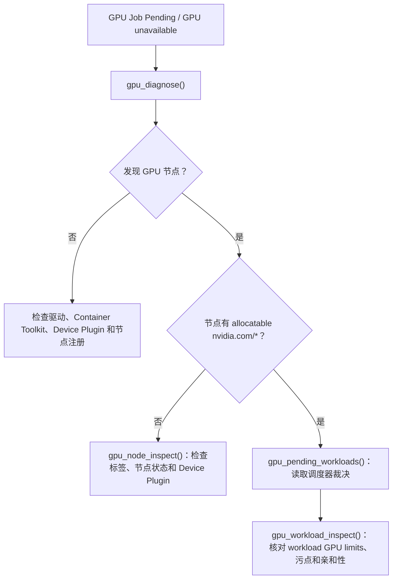

# NVIDIA GPU / AI 工作负载运维

[English](./gpu.en.md) · [文档首页](./README.md) · [RBAC 模板](../deploy/rbac/nvidia-gpu-read-only.yaml)

`k8s-mcp` 当前提供 5 个**只读** NVIDIA GPU 诊断工具。它们动态发现 Kubernetes 暴露的 `nvidia.com/*` 扩展资源，不假设固定 GPU 型号、MIG profile 或 GPU Operator 版本，因此可以用于传统 `nvidia.com/gpu`、MIG 资源以及由其他部署方式注册的 NVIDIA Device Plugin。

> [!IMPORTANT]
> GPU 诊断工具不会安装、升级或修改 NVIDIA GPU Operator，也不会修改节点标签、污点、MIG 配置或工作负载。即使服务器默认处于可读写模式，这 5 个工具也始终只读。

## 前置条件

1. Kubernetes 节点已经通过 Device Plugin 暴露 NVIDIA 扩展资源；常见主资源为 `nvidia.com/gpu`，MIG 场景还会暴露 `nvidia.com/mig-*`。
2. 如使用 NVIDIA GPU Operator，通常其运行在 `gpu-operator` namespace。若使用自定义 namespace，在 `gpu_diagnose(operator_namespace="<namespace>")` 中明确传入。
3. 使用 GPU 利用率、显存、功耗等实时指标时，继续使用已有的 Prometheus / DCGM Exporter 接入；本版本只负责资源与调度诊断，不会假设某一套 DCGM metric 名称。

## 最小 RBAC

应用 [`nvidia-gpu-read-only.yaml`](../deploy/rbac/nvidia-gpu-read-only.yaml) 可获得 GPU 诊断所需的最小只读权限：

```bash
kubectl apply -f deploy/rbac/nvidia-gpu-read-only.yaml
```

模板提供对 Nodes、Pods、Deployments、Jobs 与可选 `clusterpolicies.nvidia.com` 的 `get/list` 权限；不授予写入、删除、Pod exec 或 Secret 访问。请在使用前替换 ServiceAccount 的示例 namespace。

## 工具与推荐流程

### 1. 集群总览

```text
gpu_cluster_overview()
```

输出 GPU 节点数、每个节点的 capacity / allocatable `nvidia.com/*` 资源、活跃 GPU Pod 的 limits 总和，以及可用时的 GPU Operator ClusterPolicy 摘要。

适合先回答：**集群是否识别到 GPU、可分配资源是什么、当前有多少 GPU 工作负载。**

### 2. 单节点排查

```text
gpu_node_inspect(name="gpu-worker-01")
```

输出节点 Ready / 可调度状态、污点、NVIDIA 标签、动态发现的 GPU/MIG 资源，以及已放置到该节点的 GPU Pod。

适合排查：**节点有驱动但为何没有 `nvidia.com/gpu`、为何任务不会被调度到这台节点。**

### 3. 工作负载排查

```text
gpu_workload_inspect(name="training-job", namespace="ml", kind="Job")
gpu_workload_inspect(name="inference-api", namespace="ml", kind="Deployment")
gpu_workload_inspect(name="trainer-0", namespace="ml", kind="Pod")
```

- `Pod`：显示实际 GPU limits、所在节点、Pod phase 与调度器的 `PodScheduled=False` 原因。
- `Deployment` / `Job`：显示 Pod template 中声明的 GPU limits，并根据 selector 汇总匹配的 GPU Pod。

GPU 资源应在容器 `limits` 中声明；`gpu_workload_inspect` 显示的是 Kubernetes 实际读取到的 limits，不会猜测镜像或 CUDA 版本。

### 4. 等待调度的 GPU 任务

```text
gpu_pending_workloads()
gpu_pending_workloads(namespace="ml", limit=100)
```

只返回带 `nvidia.com/*` limits 且处于 `Pending` 的 Pod，保留调度器的原因文本，以区分 GPU 容量不足、污点/容忍、亲和性和 MIG profile 不匹配等情况。

### 5. 一键健康诊断

```text
gpu_diagnose()
gpu_diagnose(operator_namespace="nvidia")
```

按以下层次输出 findings：

1. GPU 节点是否被发现、是否 Ready、是否暴露 allocatable NVIDIA 扩展资源；
2. 可选 GPU Operator `ClusterPolicy` 是否存在及其状态；
3. 指定 operator namespace 内 Device Plugin、DCGM Exporter、MIG Manager、Validator、GPU Feature Discovery 等相关 Pod 是否 Ready；
4. 是否存在等待调度的 GPU Pod。

`ClusterPolicy` CRD 缺失、GPU Operator 不在默认 namespace、或 RBAC 无权读取时都被作为诊断信息显示，而不是让工具整体失败。

## 常见排障路径



## 本版本边界与后续路线

当前版本不提供 GPU 利用率报表、MIG 配置变更、time-slicing 变更、GPU Operator 安装/升级或 DRA ResourceClaim 写入。这些能力将先在只读发现与计划模式下提供，再考虑增加独立的高风险管理开关；不会因为 `K8S_MCP_READ_ONLY=false` 而自动开放高影响 GPU 管理操作。
