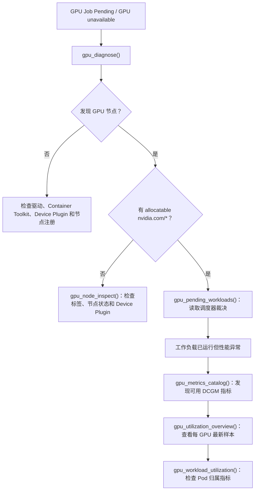

# NVIDIA GPU / AI 工作负载运维

[English](./gpu.en.md) · [文档首页](./README.md) · [RBAC 模板](../deploy/rbac/nvidia-gpu-read-only.yaml) · [Prometheus 配置](./env.md)

`k8s-mcp` 当前提供 8 个**只读** NVIDIA GPU 工具，覆盖 Kubernetes 资源/调度诊断和 Prometheus/DCGM 实时指标发现。资源工具动态识别实际暴露的 `nvidia.com/*` 扩展资源，不假设固定 GPU 型号、MIG profile 或 GPU Operator 版本；指标工具则先发现 Prometheus 中真实存在的 DCGM 指标，再允许按需指定自定义指标名。

> [!IMPORTANT]
> 所有 `gpu_*` 工具始终只读：不会安装、升级或修改 NVIDIA GPU Operator，也不会修改节点标签、污点、MIG 配置、time-slicing 或工作负载。即使 `K8S_MCP_READ_ONLY=false`，也不会自动开放高影响 GPU 管理操作。

## 前置条件

### 资源与调度诊断

1. Kubernetes 节点已经通过 Device Plugin 暴露 NVIDIA 扩展资源；常见主资源为 `nvidia.com/gpu`，MIG 场景还可能暴露 `nvidia.com/mig-*`。
2. 如使用 NVIDIA GPU Operator，其通常运行在 `gpu-operator` namespace；使用自定义 namespace 时，请传入 `gpu_diagnose(operator_namespace="<namespace>")`。

### 利用率与显存指标

指标工具复用已有 Prometheus 连接配置，不增加 Kubernetes 写权限或新的 Token：

```bash
K8S_MCP_PROMETHEUS_URL=https://prometheus.example:9090
# 可选：端点需要认证时设置
K8S_MCP_PROMETHEUS_BEARER_TOKEN=<token>
```

如果未设置 URL，可以先运行 `find_prometheus_service()`；也可以在每次 GPU 指标调用中传入 `prometheus_url`。Prometheus 必须已采集 DCGM Exporter（或其他兼容 exporter）指标。不同安装的 metric 名称和标签可能不同，因此请先运行 `gpu_metrics_catalog()`，不要假定默认指标一定存在。

## 最小 RBAC

应用 [`nvidia-gpu-read-only.yaml`](../deploy/rbac/nvidia-gpu-read-only.yaml) 可获得资源与调度诊断所需的最小只读权限：

```bash
kubectl apply -f deploy/rbac/nvidia-gpu-read-only.yaml
```

模板仅提供对 Nodes、Pods、Deployments、Jobs 与可选 `clusterpolicies.nvidia.com` 的 `get/list` 权限；不授予写入、删除、Pod exec 或 Secret 访问。指标工具直接查询 Prometheus HTTP API，因此使用其既有访问控制，而不要求扩大 Kubernetes RBAC。

## 工具与推荐流程

### 1. 资源与调度：先确定能否调度

```text
gpu_cluster_overview()
gpu_node_inspect(name="gpu-worker-01")
gpu_workload_inspect(name="trainer-0", namespace="ml", kind="Pod")
gpu_pending_workloads(namespace="ml", limit=100)
gpu_diagnose(operator_namespace="gpu-operator")
```

- `gpu_cluster_overview`：GPU 节点数、capacity / allocatable `nvidia.com/*` 资源、活跃 GPU Pod limits 与可选 ClusterPolicy。
- `gpu_node_inspect`：单节点 Ready / 可调度状态、污点、NVIDIA 标签、GPU/MIG 资源和已放置 GPU Pod。
- `gpu_workload_inspect`：Pod 的实际 GPU limits、节点与调度器裁决；Deployment / Job 的 template limits 与匹配 Pod。
- `gpu_pending_workloads`：仅列出带 `nvidia.com/*` limits 的 Pending Pod，保留调度器原因。
- `gpu_diagnose`：组合检查 GPU 节点、ClusterPolicy、GPU Operator 组件 Pod 与 Pending GPU 工作负载。

GPU 扩展资源应声明在容器 `limits` 中。工具读取 Kubernetes 实际返回的 limits，不猜测 CUDA、镜像或驱动版本。

### 2. 指标发现：先确认可查询什么

```text
gpu_metrics_catalog()
gpu_metrics_catalog(metric_prefix="DCGM_", limit=200)
```

`gpu_metrics_catalog` 通过只读 PromQL 查询列出目标 Prometheus 中匹配前缀的真实指标名及其 series 数量。默认发现 `DCGM_` 前缀，可用它确认 `DCGM_FI_DEV_GPU_UTIL`、`DCGM_FI_DEV_FB_USED` 等默认名称是否真的存在，或找到自定义 exporter 的指标命名。

### 3. 节点 / GPU 利用率：读取最新样本

```text
gpu_utilization_overview()
gpu_utilization_overview(
  utilization_metric="DCGM_FI_DEV_GPU_UTIL",
  memory_used_metric="DCGM_FI_DEV_FB_USED",
  memory_total_metric="DCGM_FI_DEV_FB_TOTAL",
)
```

工具读取三个 instant-vector 的最新原始样本，并按常见的 `Hostname`、`gpu`、`UUID`（以及兼容变体）关联为每 GPU 一行。输出包含利用率、显存已用/总量和可计算时的已用比例。**数值单位遵从你选择的 exporter metric**；工具不会在没有验证指标语义时擅自换算单位。

某个指标不存在不会隐藏其余可用指标；报告会提示缺失项，并引导回到 `gpu_metrics_catalog()` 选择真实存在的名称。

### 4. Pod 级利用率：确认归属标签后查询

```text
gpu_workload_utilization(pod_name="trainer-0", namespace="ml")
gpu_workload_utilization(
  pod_name="trainer-0",
  namespace="ml",
  metric_name="DCGM_FI_DEV_GPU_UTIL",
)
```

该工具使用精确的 Prometheus `namespace` 和 `pod` 标签读取某个 Pod 的最新指标样本，展示 GPU identity、container 和数值。它要求 exporter 已将 Kubernetes Pod 标签附加到所选指标；如果没有匹配结果，请改用 `gpu_utilization_overview()` 查看 Node/GPU 层数据，或检查 DCGM Exporter 的 Kubernetes 标签映射。

## 常见排障路径



## 边界与后续路线

本版本提供实时**瞬时**指标发现与查看，但不做长期趋势、容量预测、告警规则变更、GPU Operator 安装/升级、MIG / time-slicing 变更或 DRA ResourceClaim 写入。

| 阶段 | 状态 | 计划能力 | 安全边界 |
|---|---|---|---|
| GPU 基础诊断 | ✅ 已完成 | 节点、工作负载、Pending 调度、GPU Operator 状态综合诊断 | Kubernetes API 只读 |
| Prometheus / DCGM 瞬时观测 | ✅ 已完成 | 指标发现、每 GPU 最新利用率、Pod 归属指标 | PromQL instant query，只读 |
| 时间序列与容量分析 | ⏭️ 下一阶段 | `gpu_utilization_history`、`gpu_capacity_analyze`、`gpu_idle_resources`；限制查询窗口、步长和返回 series 数 | PromQL range query + Kubernetes 资源只读关联 |
| MIG 与 DRA 发现 | 🧭 规划中 | MIG strategy/profile/资源汇总；ResourceClaim、DeviceClass、ResourceSlice 可用性与绑定状态 | 仅发现与建议，不修改 CRD 或节点配置 |
| GPU 管理操作 | 🔒 默认不实现 | GPU Operator 生命周期、MIG/time-slicing 重配置、DRA 写入 | 若未来提供，必须使用独立于 `K8S_MCP_READ_ONLY` 的专用开关、allowlist、dry-run 计划和显式确认 |

下一阶段优先解决“GPU 是否长期空闲、请求量是否与真实利用率匹配、容量是否被碎片化”三个问题。任何高风险 GPU 管理能力都不会仅由 `K8S_MCP_READ_ONLY=false` 自动启用。
